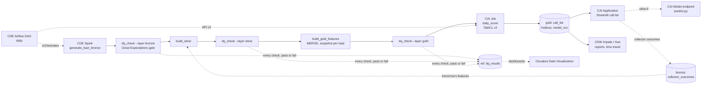

# Collections: Delinquency Roll-Forward Prediction on Cloudera

Collections teams cannot call everyone in early delinquency, so the model
decides who gets the scarce human effort first. Every day, each SMA-0 loan
(1–30 days past due) is scored for its chance of rolling into SMA-1 (31+ DPD)
within 30 days, ranked by `priority = p_roll × overdue amount`, and mapped to
a treatment band sized to dialler capacity. The model is **TabICL v2**, a
tabular foundation model that learns in context from labelled history in a
gold Iceberg table: no training step, no retraining cycle.

> Demo of the data and scoring pipeline on synthetic data, not a validated
> credit model. The model only ranks accounts; contact hours, conduct and
> frequency follow the RBI fair practices code for recovery agents.

## Architecture



| Layer | Cloudera service | Code |
|---|---|---|
| Ingest + medallion | CDE Spark, Iceberg | `cde/jobs/` |
| Orchestration | CDE Airflow | `cde/dags/collections_dag.py` |
| Daily scoring | CAI Job (CPU on federal) | `cai/jobs/daily_score.py` |
| On-demand / what-if API | CAI Model Deployment | `cai/model/predict.py` |
| Reports, time travel | CDW Impala (Hue) | `sql/reports.sql` |
| Demo UI | CAI Application | `app/` |

Databases: `rsingh_collections_delinquency_prediction_{bronze,silver,gold,ref}`
(prefix in `config/collections.yaml`, and `--db-prefix` / `DB_PREFIX` for the
CDE side). CDE resources are named `rsingh-coll-dlq-*`.

| Table | Written by | Grain |
|---|---|---|
| `bronze.loan_master` | CDE generate | loan: product, EMI, tenor, repayment mode, salary account flag |
| `bronze.loan_instalments` | CDE generate | loan × instalment: due date, paid date (NULL = unpaid) |
| `bronze.nach_presentations` | CDE generate | loan × NACH presentation: SUCCESS / BOUNCED, reason |
| `bronze.dialler_contacts` | CDE generate | loan × attempt: channel, outcome, promise-to-pay |
| `bronze.casa_credits` | CDE generate | customer × salary credit |
| `bronze.bureau_snapshot` | CDE generate | customer × monthly bureau pull |
| `bronze.collector_outcomes` | CAI app | loan × outcome recorded by a collector |
| `ref.product_map` | CDE generate | product code → name, tenor and rate bands |
| `ref.dq_results` | CDE dq_check (3x per run) | run × layer × check: severity, pass/fail, observed value, checked table's snapshot id |
| `silver.{loan, instalment, nach_presentation, collection_contact, salary_credit, bureau_score}` | CDE silver | deduplicated entities; PTP kept / broken derived |
| `gold.collections_features` | CDE gold (MERGE) | loan × weekly snapshot, SMA-0 only: 13 numeric features + label |
| `gold.collections_call_list` | CAI job | run date × loan: p_roll, priority, rank, treatment, risk signals |
| `gold.collections_holdout` | CAI job | run date × decile: roll rate, cumulative capture |
| `gold.collections_model_run` | CAI job | run date: checkpoint, context window, gold snapshot id, holdout metrics |

## Method

- **Label**: a loan in SMA-0 on snapshot date *d* rolled if it is 31+ DPD on any
  day in (*d*, *d* + 30]. NULL until 30 days have passed; each daily load fills
  in the labels that matured (Iceberg MERGE, one snapshot per load).
- **Snapshots**: every Friday for 18 months plus the as-of date (today's book).
- **Features** (all numeric, built in Spark): product, DPD now, overdue amount,
  EMI, overdue ÷ EMI, months on book, max DPD in 12 months, NACH bounces in
  6 months, broken PTPs in 3 months, contacts reached in 30 days, salary credit
  in 30 days, salary account with the bank, bureau score.
- **Context**: the most recent labelled rows (50,000 on GPU, 10,000 on CPU,
  `config/policy.yaml`). A run for date *D* only uses labels known on *D*
  (snapshots up to *D* − 30 days), so backfills are honest.
- **Holdout (trust number)**: score the latest 4 labelled weeks with a context
  ending 30 days before them. Reported as capture: "the top 10% of calls catch
  X% of the loans that actually rolled", next to calling by DPD alone.
- **Priority** = p_roll × overdue amount. **Treatment** by percentile across the
  book: top 10% agent call today (field visit if unreachable), next 30% agent
  or IVR with a payment link, rest SMS / WhatsApp. Cut-offs are business
  settings (policy file, app sliders), not model settings.
- **Lineage**: every run records the pinned checkpoint
  (`tabicl-classifier-v2-20260212.ckpt`), the TabICL version, the context window
  and the Iceberg snapshot id of gold it read; the endpoint rebuilds exactly that
  context with `FOR SYSTEM_VERSION AS OF`.

Results on go01 (NVIDIA L4, 50,000-row context, nine daily runs
31 Jul - 25 Sep 2026): holdout AUC 0.85-0.87; the top 10% of calls catch 30-37%
of the loans that rolled (DPD alone 28-30%) and 52-56% of the rolled overdue
amount; the agent bands (top 40%) catch 80-82% (DPD alone 72-74%). DPD is a strong
baseline by construction (a loan at 25 DPD only has to stay unpaid 6 more days);
the model adds most on low-DPD loans that will still roll, and on value.

On federal (CPU, 10,000-row context, run date 2026-10-02): AUC 0.850; the top 10%
catch 32% of rolls (DPD alone 30%) and 55% of the rolled overdue amount; the top
40% catch 80% (DPD alone 72%). Inside the go01 ranges, AUC at the low end, with a
5x smaller context; the daily job takes about 10 min on 4 vCPU.

Synthetic data: 150,000 loans (about 106,000 active by the as-of date) from
April 2024. Each loan has a hidden monthly stress level (loan risk from product
and origination bureau, AR(1) noise, occasional income shocks, a book-wide
post-festive and monsoon factor). Stress drives missed EMIs, missing salary
credits, bureau drift, contactability and kept promises; a salary credit, a
reached contact or a NACH re-presentation raises the chance of curing on a
given day. About 24% of SMA-0 loans roll within 30 days. History is
prefix-stable: a later as-of date only adds days.

## Run locally

Python 3.11 and Java 17.

```bash
python3.11 -m venv .venv && .venv/bin/pip install -r requirements-dev.txt
export HF_HOME=$PWD/.hf_cache

# CDE jobs on local Spark + Iceberg (about 1 minute), export gold to data/parquet
.venv/bin/python scripts/run_cde_local.py all --as-of 2026-09-25
.venv/bin/python scripts/run_cde_local.py history            # Iceberg snapshots of gold

# CAI jobs on parquet (first run downloads the TabICL checkpoint, ~110 MB)
.venv/bin/python cai/jobs/daily_score.py --backend parquet
.venv/bin/python cai/jobs/backfill_history.py --weeks 4 --backend parquet
.venv/bin/python cai/model/test_endpoint.py --local           # demo loan + salary-credit what-if

COLL_STORAGE_BACKEND=parquet .venv/bin/streamlit run app/streamlit_app.py
.venv/bin/pytest -q
```

Add `--stub` to the CAI scripts for a logistic-regression stand-in (no checkpoint).

## Deploy on Cloudera

The environment is **federal** (from 3 Oct 2026; go01 until then, left as it was):
CDE vcluster `bxjjm2cr` (shared by several projects), CDW Impala
`coordinator-federal-impala-1.dw-federal-cdp-env.dp5i-5vkq.cloudera.site:443`
(HTTP transport, `cliservice`, SSL, LDAP workload user), CAI workbench
`https://federal-cml.federal.dp5i-5vkq.cloudera.site`. Iceberg tables live under
`s3a://federal-buk-574bcea0/data/warehouse/tablespace/external/hive/<db>.db/<table>`.
Every resource is created from the laptop by idempotent scripts; the IDs are in
`docs/DEMO_RUNBOOK.md`.

```bash
set -a; source .env; set +a                         # COLL_IMPALA_*, COLL_CAI_HOST, COLL_CAI_API_KEY
./cde/scripts/deploy_jobs.sh                        # CDE: repository, python-env, 4 Spark jobs
python ci/setup_cai.py --no-serving --sync          # CAI: project, environment, jobs; sync-code
#   ... first daily run published (CAI job rsingh-coll-dlq-daily-score) ...
COLL_ENDPOINT_API_KEY=... python ci/setup_cai.py    # CAI: model, then the application
python cde/scripts/set_airflow_variables.py         # Airflow: the four COLL_CAI_* Variables
./cde/scripts/deploy_dag.sh                         # CDE: the DAG, registered paused
```

### 1. CDE: Spark jobs and Airflow DAG

CDE CLI configured for the vcluster (`~/.cde/config.yaml`), repo pushed to GitHub.

```bash
./cde/scripts/deploy_jobs.sh      # CDE Repository rsingh-coll-dlq-pipeline + 4 Spark jobs
./cde/scripts/deploy_dag.sh       # Airflow job rsingh-coll-dlq-orchestration (daily, registered paused)
./cde/scripts/backfill_drill.sh   # optional: a few daily loads = a few gold snapshots
```

Each job gets a 2-core / 4 GB driver and 1-4 executors (2 at start) of 4 cores /
8 GB (`RESOURCES` in `deploy_jobs.sh`, every value overridable: `DRIVER_CORES`,
`DRIVER_MEMORY`, `EXECUTOR_CORES`, `EXECUTOR_MEMORY`, `MIN_EXECUTORS`,
`INITIAL_EXECUTORS`, `MAX_EXECUTORS`). The federal queue caps at 27 vCPU / ~110 GB
for all projects on the vcluster, and a run whose driver plus initial executors
do not fit is rejected before it starts ("cannot fit application"); go01's
4-core driver with 4 initial executors does not fit. `cde job run --wait` can
return before the run ends on this vcluster: poll `cde run describe --id <id>`.
The first job after the vcluster has been idle can wait several minutes for scale-up.
Stage timings on federal: `docs/PROJECT_LOG.md`.

After a code change: `git push`, then `cde repository sync --name rsingh-coll-dlq-pipeline`
(re-run `deploy_dag.sh` if the DAG changed, `deploy_jobs.sh` if resources changed).

The DAG registers **paused** (`is_paused_upon_creation=True`): an unpaused
registration, or unpausing later, runs the latest closed interval at once.
Unpause with `cde job schedule unpause --name rsingh-coll-dlq-orchestration`.
Run it by hand: Airflow UI > `collections_roll_forward_pipeline` > Trigger
(optional config `{"as_of": "2026-09-25"}`; empty = yesterday), or
`cde job run --name rsingh-coll-dlq-orchestration`. The DAG's `start_date` must be
in the past: while it is in the future Airflow greys out the trigger button and a
run started from CDE "succeeds" in seconds without running any task.

### 2. CAI project (scripted)

`ci/setup_cai.py` drives the CAI API v2 from the laptop (`COLL_CAI_HOST`, and
`COLL_CAI_API_KEY`, an **API v2** key from User Settings > API Keys). It finds
each resource by name, creates what is missing and corrects what drifted
(`--dry-run` shows the changes). The resources are defined in `ci/cai_jobs.py`:
project `rsingh-coll-dlq` cloned from this repo, runtime
`ml-runtime-pbj-jupyterlab-python3.11-standard:2026.08.1-b5`, project
environment variables `HF_HOME=/home/cdsw/.hf_cache`, `COLL_IMPALA_USER` and
`COLL_IMPALA_PASSWORD` (copied from the caller, never printed), and:

| Resource | Name | Size |
|---|---|---|
| Job | `rsingh-coll-dlq-sync-code` (`cai/jobs/sync_code.py`) | 2 vCPU / 8 GB, CPU |
| Job | `rsingh-coll-dlq-daily-score` (`cai/jobs/daily_score.py`) | 4 vCPU / 16 GB, CPU |
| Job | `rsingh-coll-dlq-backfill-history` (`cai/jobs/backfill_history.py`, one-off, `COLL_BACKFILL_WEEKS`) | 4 vCPU / 16 GB, CPU |
| Model | `rsingh-coll-dlq-roll-scorer` (`cai/model/predict.py`, `predict`) | 4 vCPU / 16 GB, CPU, 1 replica, authentication on |
| Application | `rsingh-coll-dlq-call-list` (`app/run.py`) | 2 vCPU / 4 GB |

`rsingh-coll-dlq-sync-code` replaces `git pull` in a session: `git fetch` +
`reset --hard` to `origin/main`, then `pip install -r requirements.txt` when the
file changed. Run it after every push (`setup_cai.py --sync` does); restart the
model and app to load new code.

**CPU only on federal.** GPUs cannot be scheduled from this project: a 1-GPU
run, and 8 vCPU / 32 GB, sat in `ENGINE_SCHEDULING`, while 4 vCPU / 16 GB starts
at once. TabICL picks `cuda`, then `mps`, then `cpu`, and the context size
follows: 50,000 rows with CUDA, 10,000 without (`config/policy.yaml`). go01 ran
the job and model on an NVIDIA L4 with the 50,000-row context.

Session sanity checks (a session terminal in the project):

```bash
python -c "from importlib.metadata import version; import torch; print('tabicl', version('tabicl'), '| torch', torch.__version__, '| cuda', torch.cuda.is_available())"

# Impala reachable with the project credentials
python -c "from coll.storage import get_storage; print(get_storage('impala').query('SELECT COUNT(*) n, MAX(snapshot_date) d FROM rsingh_collections_delinquency_prediction_gold.collections_features'))"

# reads gold via Impala, downloads the checkpoint once, holdout + scoring, writes no table
python cai/jobs/daily_score.py --dry-run

# endpoint logic in-process: demo loan, then with a salary credit and two reached contacts
python cai/model/test_endpoint.py --local --context impala
```

Project environment variables only reach sessions started after they were
saved. For an air-gapped customer: download `tabicl-classifier-v2-20260212.ckpt`
from `jingang/TabICL` on a connected machine, upload it to `models/`, and set
`COLL_MODEL_MODEL_PATH=/home/cdsw/models/tabicl-classifier-v2-20260212.ckpt`.

### 3. CAI Job `rsingh-coll-dlq-daily-score`

Script `cai/jobs/daily_score.py`, arguments empty (Airflow passes `COLL_RUN_DATE`
and `COLL_TRIGGERED_BY` in the run's environment; the GitHub check passes
`COLL_DRY_RUN=1`), schedule Manual, timeout 60 min (the UI default of 15 min is
too short). The scripts ignore the `-f` argument a Jupyter-kernel runtime adds.
Run it once, then `rsingh-coll-dlq-backfill-history` (8 weeks by default) so the
app's trust and history tabs have several run dates. Measured times on federal CPU: `docs/PROJECT_LOG.md`.

### 4. CAI Model `rsingh-coll-dlq-roll-scorer`

Created, built and deployed once by `setup_cai.py` (without `--no-serving`) once
a published run exists: file `cai/model/predict.py`, function `predict`,
4 vCPU / 16 GB, 1 replica, authentication on. The first build installs
`requirements.txt` (torch is large) and takes several minutes. Example input:
the output of `python cai/model/test_endpoint.py --print-request`.

Each replica rebuilds the context of the latest daily run (latest run date) from
gold at start-up, so **restart** the model after the morning run to serve the new
context. A code change needs **Deploy New Build** (a restart keeps the old build).
Check in the Test tab: the `model` block shows the run date, context window and
`"context_rows": 10000` (CPU).

### 5. CAI Application `rsingh-coll-dlq-call-list`

Script `app/run.py`, 2 vCPU / 4 GB, subdomain `rsingh-coll-dlq-call-list`.
`setup_cai.py` writes `COLL_ENDPOINT_URL` and `COLL_ENDPOINT_ACCESS_KEY` from the
model into the project environment, plus `COLL_ENDPOINT_API_KEY` when the caller
sets it (a Model API key, or a CAI API key the endpoint accepts), and creates the
application only once that key is in the project. The Impala credentials come
from the project. In the Loan what-if tab the result says whether it was scored
by the endpoint or in-process (the fallback when the endpoint variables are
missing). After a code change: run `rsingh-coll-dlq-sync-code`, then restart the
application.

### 5a. Airflow triggers the CAI Job

`python cde/scripts/set_airflow_variables.py` (`--dry-run` first) sets
`COLL_CAI_HOST`, `COLL_CAI_PROJECT_ID`, `COLL_CAI_JOB_ID` (looked up by name) and
`COLL_CAI_API_KEY` through the vcluster's Airflow REST API, with a Knox token for
the workload user. It touches only these four keys and never prints a value.
Without `COLL_CAI_HOST` the DAG skips the CAI step. A run scored by Airflow shows
`triggered_by = airflow` in `collections_model_run`. The DAG polls the CAI run
every 30 s for up to 90 min; a dropped connection or a 5xx is retried (up to 10
polls in a row), a 4xx fails the task.

### 5b. GitHub -> CAI check

`.github/workflows/ci.yml` runs the unit tests and a small local pipeline on every
push and pull request. On a push to main, `cai-pipeline` then runs
`ci/trigger_cai_pipeline.py`: `rsingh-coll-dlq-sync-code` to the pushed commit,
then `rsingh-coll-dlq-daily-score` with `COLL_DRY_RUN=1` (holdout and book
scoring with TabICL, no table written). It needs the repository secrets
`CAI_URL`, `CAI_API_KEY` and `CAI_PROJECT_ID`; until `CAI_URL` is set it prints a
notice and passes. The daily DAG is what publishes.

### Daily operation

| When (IST) | What | Who |
|---|---|---|
| 06:00 | DAG: generate → dq → silver → dq → gold → dq (new Iceberg snapshot) → CAI job writes the call list | Airflow |
| after the run | restart `rsingh-coll-dlq-roll-scorer` so what-ifs use the new context | manual (or an extra DAG step) |
| working day | collections team works the list in the app; outcomes land in `bronze.collector_outcomes` | app |
| next 06:00 | silver unions the outcomes into contact history; tomorrow's features include them | Airflow |

Troubleshooting seen while deploying:

| Symptom | Cause / fix |
|---|---|
| Airflow trigger button greyed out; CDE run "succeeds" in seconds | DAG `start_date` in the future; keep it in the past (`catchup=False` prevents back-runs) |
| CAI job: `unrecognized arguments: -f /tmp/jupyter/...` | Jupyter-kernel runtime; fixed by `parse_known_args` (pull the latest code) |
| Endpoint serves an older run date | backfills write older dates later; the endpoint picks the latest run date (fixed), restart after new runs |
| `ParseException` on insert | Impala reserved word as a column name (e.g. `rows`); rename the column |
| First Impala query hangs for minutes | the virtual warehouse is resuming from auto-suspend; wait, or open the app a few minutes before a demo |
| `cuda False` on a GPU session (go01) | torch built for a newer CUDA than the driver: `pip3 install --force-reinstall --no-deps torch --index-url https://download.pytorch.org/whl/cu126` |
| CAI backfill `ENGINE_SUCCEEDED` with dates missing | the engine was ended mid-date (two runs on federal, one during a workbench resize); each date now runs in its own process and a killed date fails the job. Re-run with `COLL_BACKFILL_WEEKS` covering the gap |
| CDE run rejected: "queue ... cannot fit application" | driver plus initial executors exceed the shared federal queue; use the `deploy_jobs.sh` defaults |
| `cde job run --wait` returns while the run is still going | poll `cde run describe --id <id>` until `succeeded` / `failed` |
| CAI job or model stays in `ENGINE_SCHEDULING` | a GPU, or more than 4 vCPU / 16 GB, cannot be scheduled from this project on federal; keep `ci/cai_jobs.py` at 4 vCPU / 16 GB / 0 GPU |
| Airflow task fails on one CAI poll (`Connection reset by peer`) | the CAI run goes on; the DAG now retries failed polls instead of failing |

### 6. Run anywhere else

The app has no Cloudera-only dependency: `docker build -t collections-app .`
and run it on parquet exports or against CDW Impala (see `Dockerfile`).

## Layout

```
coll/          shared logic: config, features, TabICL wrapper, priority bands, holdout, storage, pipeline, scoring
cde/jobs/      Spark jobs (generate/silver/gold: PySpark + stdlib; dq_check: + Great Expectations)
cde/dags/      Airflow DAG (daily)
cde/scripts/   deploy_jobs.sh, deploy_dag.sh, backfill_drill.sh, set_airflow_variables.py
cai/jobs/      daily_score.py, backfill_history.py, sync_code.py
ci/            CAI resources (cai_jobs.py), setup_cai.py (API v2), trigger_cai_pipeline.py (GitHub -> CAI)
cai/model/     predict.py (endpoint), test_endpoint.py
app/           Streamlit app + CAI launcher
config/        collections.yaml (names, storage, model), policy.yaml (context, holdout, treatment bands)
sql/           Hue report and time-travel queries
docs/          demo runbook, PROJECT_LOG.md (dated history of the build and every platform change)
scripts/       run_cde_local.py (CDE jobs on a laptop)
```

## Sources

- [TabICL on Hugging Face](https://huggingface.co/jingang/TabICL) · [TabICL (GitHub)](https://github.com/soda-inria/tabicl)
- [RBI: early recognition of financial distress (SMA classes)](https://www.rbi.org.in/)
- [Cloudera AI: creating and deploying a model](https://docs.cloudera.com/machine-learning/cloud/models/index.html)
