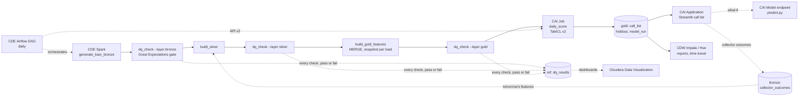

# Collections: Delinquency Roll-Forward Prediction on Cloudera

Collections teams cannot call everyone in early delinquency, so the model
decides who gets the scarce human effort first. Every day, each SMA-0 loan
(1–30 days past due) is scored for its chance of rolling into SMA-1 (31+ DPD)
within 30 days, ranked by `priority = p_roll × overdue amount`, and mapped to
a treatment band sized to dialler capacity. The model is **TabICL v2**, a
tabular foundation model that learns in context from labelled history in a
gold Iceberg table: no training step, no retraining cycle.

> Demo of the data and scoring pipeline on synthetic data, not a validated
> credit model. The model only ranks accounts; contact hours, conduct and
> frequency follow the RBI fair practices code for recovery agents.

## Architecture



| Layer | Cloudera service | Code |
|---|---|---|
| Ingest + medallion | CDE Spark, Iceberg | `cde/jobs/` |
| Orchestration | CDE Airflow | `cde/dags/collections_dag.py` |
| Daily scoring | CAI Job (GPU) | `cai/jobs/daily_score.py` |
| On-demand / what-if API | CAI Model Deployment | `cai/model/predict.py` |
| Reports, time travel | CDW Impala (Hue) | `sql/reports.sql` |
| Demo UI | CAI Application | `app/` |

Databases: `rsingh_collections_delinquency_prediction_{bronze,silver,gold,ref}`
(prefix in `config/collections.yaml`, and `--db-prefix` / `DB_PREFIX` for the
CDE side). CDE resources are named `rsingh-coll-dlq-*`.

| Table | Written by | Grain |
|---|---|---|
| `bronze.loan_master` | CDE generate | loan: product, EMI, tenor, repayment mode, salary account flag |
| `bronze.loan_instalments` | CDE generate | loan × instalment: due date, paid date (NULL = unpaid) |
| `bronze.nach_presentations` | CDE generate | loan × NACH presentation: SUCCESS / BOUNCED, reason |
| `bronze.dialler_contacts` | CDE generate | loan × attempt: channel, outcome, promise-to-pay |
| `bronze.casa_credits` | CDE generate | customer × salary credit |
| `bronze.bureau_snapshot` | CDE generate | customer × monthly bureau pull |
| `bronze.collector_outcomes` | CAI app | loan × outcome recorded by a collector |
| `ref.product_map` | CDE generate | product code → name, tenor and rate bands |
| `ref.dq_results` | CDE dq_check (3x per run) | run × layer × check: severity, pass/fail, observed value, checked table's snapshot id |
| `silver.{loan, instalment, nach_presentation, collection_contact, salary_credit, bureau_score}` | CDE silver | deduplicated entities; PTP kept / broken derived |
| `gold.collections_features` | CDE gold (MERGE) | loan × weekly snapshot, SMA-0 only: 13 numeric features + label |
| `gold.collections_call_list` | CAI job | run date × loan: p_roll, priority, rank, treatment, risk signals |
| `gold.collections_holdout` | CAI job | run date × decile: roll rate, cumulative capture |
| `gold.collections_model_run` | CAI job | run date: checkpoint, context window, gold snapshot id, holdout metrics |

## Method

- **Label**: a loan in SMA-0 on snapshot date *d* rolled if it is 31+ DPD on any
  day in (*d*, *d* + 30]. NULL until 30 days have passed; each daily load fills
  in the labels that matured (Iceberg MERGE, one snapshot per load).
- **Snapshots**: every Friday for 18 months plus the as-of date (today's book).
- **Features** (all numeric, built in Spark): product, DPD now, overdue amount,
  EMI, overdue ÷ EMI, months on book, max DPD in 12 months, NACH bounces in
  6 months, broken PTPs in 3 months, contacts reached in 30 days, salary credit
  in 30 days, salary account with the bank, bureau score.
- **Context**: the most recent labelled rows (50,000 on GPU, 10,000 on CPU,
  `config/policy.yaml`). A run for date *D* only uses labels known on *D*
  (snapshots up to *D* − 30 days), so backfills are honest.
- **Holdout (trust number)**: score the latest 4 labelled weeks with a context
  ending 30 days before them. Reported as capture: "the top 10% of calls catch
  X% of the loans that actually rolled", next to calling by DPD alone.
- **Priority** = p_roll × overdue amount. **Treatment** by percentile across the
  book: top 10% agent call today (field visit if unreachable), next 30% agent
  or IVR with a payment link, rest SMS / WhatsApp. Cut-offs are business
  settings (policy file, app sliders), not model settings.
- **Lineage**: every run records the pinned checkpoint
  (`tabicl-classifier-v2-20260212.ckpt`), the TabICL version, the context window
  and the Iceberg snapshot id of gold it read; the endpoint rebuilds exactly that
  context with `FOR SYSTEM_VERSION AS OF`.

Results on the demo platform (GPU, 50,000-row context, nine daily runs
31 Jul - 25 Sep 2026): holdout AUC 0.85-0.87; the top 10% of calls catch 30-37%
of the loans that rolled (DPD alone 28-30%) and 52-56% of the rolled overdue
amount; the agent bands (top 40%) catch 80-82% (DPD alone 72-74%). DPD is a strong
baseline by construction (a loan at 25 DPD only has to stay unpaid 6 more days);
the model adds most on low-DPD loans that will still roll, and on value.

Synthetic data: 150,000 loans (about 106,000 active by the as-of date) from
April 2024. Each loan has a hidden monthly stress level (loan risk from product
and origination bureau, AR(1) noise, occasional income shocks, a book-wide
post-festive and monsoon factor). Stress drives missed EMIs, missing salary
credits, bureau drift, contactability and kept promises; a salary credit, a
reached contact or a NACH re-presentation raises the chance of curing on a
given day. About 24% of SMA-0 loans roll within 30 days. History is
prefix-stable: a later as-of date only adds days.

## Run locally

Python 3.11 and Java 17.

```bash
python3.11 -m venv .venv && .venv/bin/pip install -r requirements-dev.txt
export HF_HOME=$PWD/.hf_cache

# CDE jobs on local Spark + Iceberg (about 1 minute), export gold to data/parquet
.venv/bin/python scripts/run_cde_local.py all --as-of 2026-09-25
.venv/bin/python scripts/run_cde_local.py history            # Iceberg snapshots of gold

# CAI jobs on parquet (first run downloads the TabICL checkpoint, ~110 MB)
.venv/bin/python cai/jobs/daily_score.py --backend parquet
.venv/bin/python cai/jobs/backfill_history.py --weeks 4 --backend parquet
.venv/bin/python cai/model/test_endpoint.py --local           # demo loan + salary-credit what-if

COLL_STORAGE_BACKEND=parquet .venv/bin/streamlit run app/streamlit_app.py
.venv/bin/pytest -q
```

Add `--stub` to the CAI scripts for a logistic-regression stand-in (no checkpoint).

## Deploy on Cloudera

### 1. CDE: Spark jobs and Airflow DAG

CDE CLI configured for the vcluster (`~/.cde/config.yaml`), repo pushed to GitHub.

```bash
./cde/scripts/deploy_jobs.sh      # CDE Repository rsingh-coll-dlq-pipeline + 4 Spark jobs
./cde/scripts/deploy_dag.sh       # Airflow job rsingh-coll-dlq-orchestration (daily)
./cde/scripts/backfill_drill.sh   # optional: a few daily loads = a few gold snapshots
```

Each job gets a 4-core / 8 GB driver and 2-8 executors (4 at start) of 4 cores /
8 GB (`RESOURCES` in `deploy_jobs.sh`). Measured on the demo vcluster: generate
3-4.5 min, dq_check / silver / gold about 1.5 min each (mostly pod start-up),
so a full DAG run including the CAI step and the three `dq_*` gates takes
about 20 minutes (see `docs/PROJECT_LOG.md` for a measured run). The first job
after the vcluster has been idle can wait several minutes (up to 20+) for scale-up.

After a code change: `git push`, then `cde repository sync --name rsingh-coll-dlq-pipeline`
(re-run `deploy_dag.sh` if the DAG changed, `deploy_jobs.sh` if resources changed).

Run the DAG by hand: Airflow UI > `collections_roll_forward_pipeline` > Trigger
(optional config `{"as_of": "2026-09-25"}`; empty = yesterday), or
`cde job run --name rsingh-coll-dlq-orchestration`. The DAG's `start_date` must be
in the past: while it is in the future Airflow greys out the trigger button and a
run started from CDE "succeeds" in seconds without running any task.

### 2. CAI project and session

New project `collections-tabicl` from this Git repo, Python 3.11 runtime.
Project Settings > Advanced > environment variables (inherited by sessions,
jobs, models and apps):

| Variable | Value |
|---|---|
| `HF_HOME` | `/home/cdsw/.hf_cache` |
| `COLL_IMPALA_USER` / `COLL_IMPALA_PASSWORD` | workload user / password (LDAP) |
| `COLL_IMPALA_HOST` | only if not the VW host in `config/collections.yaml` |

Session terminal (GPU profile if available):

```bash
git pull
pip3 install -r requirements.txt
python -c "from importlib.metadata import version; import torch; print('tabicl', version('tabicl'), '| torch', torch.__version__, torch.version.cuda, '| cuda', torch.cuda.is_available())"

# Impala reachable with the project credentials
python -c "from coll.storage import get_storage; print(get_storage('impala').query('SELECT COUNT(*) n, MAX(snapshot_date) d FROM rsingh_collections_delinquency_prediction_gold.collections_features'))"

# reads gold via Impala, downloads the checkpoint once, holdout + scoring, writes no table
python cai/jobs/daily_score.py --dry-run

# endpoint logic in-process: demo loan, then with a salary credit and two reached contacts
python cai/model/test_endpoint.py --local --context impala
```

`pip` installs the latest torch, currently built for CUDA 13, which needs NVIDIA
driver 580+ (`nvidia-smi`). On an older driver, reinstall torch from the matching
index, e.g. `pip3 install --force-reinstall --no-deps torch --index-url https://download.pytorch.org/whl/cu126`.
The resolver warnings about `mlflow`, `cml` and `protobuf` after the install are
harmless for this project. Project environment variables only reach sessions
started after they were saved.

Measured on an NVIDIA L4 (24 GB): dry run with a 50,000-row context about 1 min
(plus a one-off ~110 MB checkpoint download into `HF_HOME`); the endpoint builds
its context in about 11 s and scores a request in 0.3 s.

For an air-gapped customer: download `tabicl-classifier-v2-20260212.ckpt` from
`jingang/TabICL` on a connected machine, upload it to `models/`, and set
`COLL_MODEL_MODEL_PATH=/home/cdsw/models/tabicl-classifier-v2-20260212.ckpt`.

### 3. CAI Job

Jobs > New Job: name `collections-daily-score`, script `cai/jobs/daily_score.py`,
arguments empty (Airflow passes `COLL_RUN_DATE` and `COLL_TRIGGERED_BY`),
Python 3.11 (Workbench or JupyterLab editor; the scripts ignore the `-f` argument
a Jupyter-kernel runtime adds), GPU profile (or 4 vCPU / 16 GB), schedule Manual.
Run it once (about 1.5 min on the GPU), then `python cai/jobs/backfill_history.py --weeks 8`
from a session so the app's trust and history tabs have several run dates
(about 1.5 min per week on the GPU).

### 4. CAI Model Deployment

Model Deployments > New Model: name `collections-roll-scorer`, file
`cai/model/predict.py`, function `predict`, Python 3.11, GPU profile (or 4 vCPU /
16 GB), 1 replica, authentication on. Example input: the output of
`python cai/model/test_endpoint.py --print-request`. The first build installs
`requirements.txt` (torch is large) and takes several minutes.

Each replica rebuilds the context of the latest daily run (latest run date) from
gold at start-up, so **restart** the model after the morning run to serve the new
context. A code change needs **Deploy New Build** (a restart keeps the old build).
Check in the Test tab: the `model` block shows the run date, context window and
`"context_rows": 50000`.

### 5. CAI Application

Applications > New Application: name `Collections Call List`, subdomain
`collections`, script `app/run.py`, Python 3.11, 2 vCPU / 4 GB. So what-ifs call
the model endpoint, set:

| Variable | Where to find it |
|---|---|
| `COLL_ENDPOINT_URL` | model Overview, URL in the sample curl (`https://modelservice.<domain>/model`) |
| `COLL_ENDPOINT_ACCESS_KEY` | model Settings |
| `COLL_ENDPOINT_API_KEY` | User Settings > API Keys, Model API key (authentication is on) |

The Impala credentials come from the project. In the Loan what-if tab the result
says whether it was scored by the endpoint or in-process (the fallback when the
endpoint variables are missing). After a code change: `git pull` in a session,
then restart the application.

### 5a. Airflow triggers the CAI Job

Print the ids in a session terminal:

```bash
python -c "
import os, cmlapi
c = cmlapi.default_client()
pid = os.environ['CDSW_PROJECT_ID']
print('COLL_CAI_HOST       =', 'https://' + os.environ['CDSW_DOMAIN'])
print('COLL_CAI_PROJECT_ID =', pid)
for j in c.list_jobs(pid).jobs:
    print('COLL_CAI_JOB_ID     =', j.id, '(' + j.name + ')')
"
```

Create an **API v2** key (User Settings > API Keys; not the Model API key used by
the app), then in the CDE Airflow UI > Admin > Variables set `COLL_CAI_HOST`,
`COLL_CAI_PROJECT_ID`, `COLL_CAI_JOB_ID` (the id of `collections-daily-score`) and
`COLL_CAI_API_KEY`. Without `COLL_CAI_HOST` the DAG skips the CAI step. A run
scored by Airflow shows `triggered_by = airflow` in `collections_model_run`.

### Daily operation

| When (IST) | What | Who |
|---|---|---|
| 06:00 | DAG: generate → dq → silver → dq → gold → dq (new Iceberg snapshot) → CAI job writes the call list | Airflow (about 20 min) |
| after the run | restart `collections-roll-scorer` so what-ifs use the new context | manual (or an extra DAG step) |
| working day | collections team works the list in the app; outcomes land in `bronze.collector_outcomes` | app |
| next 06:00 | silver unions the outcomes into contact history; tomorrow's features include them | Airflow |

Troubleshooting seen while deploying:

| Symptom | Cause / fix |
|---|---|
| Airflow trigger button greyed out; CDE run "succeeds" in seconds | DAG `start_date` in the future; keep it in the past (`catchup=False` prevents back-runs) |
| CAI job: `unrecognized arguments: -f /tmp/jupyter/...` | Jupyter-kernel runtime; fixed by `parse_known_args` (pull the latest code) |
| Endpoint serves an older run date | backfills write older dates later; the endpoint picks the latest run date (fixed), restart after new runs |
| `ParseException` on insert | Impala reserved word as a column name (e.g. `rows`); rename the column |
| First Impala query hangs for minutes | the virtual warehouse is resuming from auto-suspend; wait, or open the app a few minutes before a demo |
| `cuda False` on a GPU session | torch built for a newer CUDA than the driver; see the torch note in section 2 |

### 6. Run anywhere else

The app has no Cloudera-only dependency: `docker build -t collections-app .`
and run it on parquet exports or against CDW Impala (see `Dockerfile`).

## Layout

```
coll/          shared logic: config, features, TabICL wrapper, priority bands, holdout, storage, pipeline, scoring
cde/jobs/      Spark jobs (generate/silver/gold: PySpark + stdlib; dq_check: + Great Expectations)
cde/dags/      Airflow DAG (daily)
cde/scripts/   deploy_jobs.sh, deploy_dag.sh, backfill_drill.sh
cai/jobs/      daily_score.py, backfill_history.py
cai/model/     predict.py (endpoint), test_endpoint.py
app/           Streamlit app + CAI launcher
config/        collections.yaml (names, storage, model), policy.yaml (context, holdout, treatment bands)
sql/           Hue report and time-travel queries
docs/          demo runbook, PROJECT_LOG.md (dated history of the build and every platform change)
scripts/       run_cde_local.py (CDE jobs on a laptop)
```

## Sources

- [TabICL on Hugging Face](https://huggingface.co/jingang/TabICL) · [TabICL (GitHub)](https://github.com/soda-inria/tabicl)
- [RBI: early recognition of financial distress (SMA classes)](https://www.rbi.org.in/)
- [Cloudera AI: creating and deploying a model](https://docs.cloudera.com/machine-learning/cloud/models/index.html)
